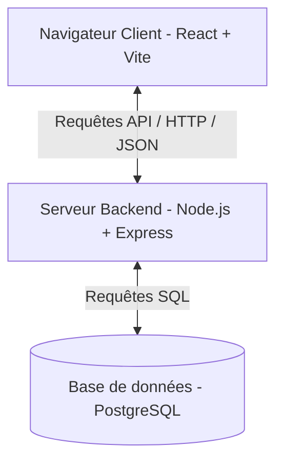

# 📘 Guide Complet du Projet HUMAI

Bienvenue dans le guide explicatif de **HUMAI**, une application moderne de gestion des ressources humaines (RH). Ce document a pour but de vous expliquer de manière simple et structurée le fonctionnement global du projet, l'utilité de chaque fichier, ainsi que la manière de le lancer.

---

## 1. Architecture Générale

Le projet est conçu selon un modèle **Client-Serveur** (Fullstack) composé de trois couches principales :



1. **Le Frontend (Client)** : Construit en **React** (avec l'outil de build ultra-rapide **Vite**). Il s'occupe uniquement d'afficher l'interface utilisateur graphique et de capturer les actions (formulaires, clics).
2. **Le Backend (Serveur)** : Un serveur **Node.js** avec le framework **Express**. Il écoute les demandes du frontend, vérifie l'identité des utilisateurs, et traite les requêtes.
3. **La Base de données (Database)** : **PostgreSQL** stocke de façon permanente et sécurisée toutes les données (utilisateurs, rôles, autorisations).

---

## 2. Guide des Fichiers du Projet

Voici à quoi sert chaque fichier du projet, divisé entre le Frontend et le Backend.

### 💻 Partie Frontend (Interface Utilisateur)

Ces fichiers gèrent ce que l'utilisateur voit à l'écran.

| Fichier | Rôle / Utilité |
| :--- | :--- |
| [package.json (Root)](file:///c:/Users/Camar/Desktop/FrontendYboost/package.json) | Liste les outils et dépendances du frontend (React, Tailwind CSS v4, Recharts, Lucide Icons). |
| [vite.config.js](file:///c:/Users/Camar/Desktop/FrontendYboost/vite.config.js) | Configure le serveur de développement Vite. Il contient notamment une règle de **proxy** qui redirige automatiquement toutes les requêtes `/api/*` vers le backend (sur le port 5000). |
| [src/main.jsx](file:///c:/Users/Camar/Desktop/FrontendYboost/src/main.jsx) | Le point d'entrée principal de l'application React qui monte le composant racine sur la page HTML. |
| [src/App.jsx](file:///c:/Users/Camar/Desktop/FrontendYboost/src/App.jsx) | Gère la session utilisateur. Il vérifie si un jeton (`token`) existe en mémoire locale (`localStorage`). Si oui, il affiche le Tableau de Bord, sinon il redirige vers la Page de Connexion. |
| [src/pages/LoginPage.jsx](file:///c:/Users/Camar/Desktop/FrontendYboost/src/pages/LoginPage.jsx) | Structure la page de connexion : un formulaire d'authentification à gauche et un panneau de présentation marketing animé à droite. |
| [src/pages/DashboardPage.jsx](file:///c:/Users/Camar/Desktop/FrontendYboost/src/pages/DashboardPage.jsx) | Contient l'interface complète du Tableau de Bord (statistiques, graphiques d'évolution, répartition des effectifs par département, flux d'activité récente, événements à venir, barre de recherche et bouton d'action IA). |
| [src/components/auth/LoginForm.jsx](file:///c:/Users/Camar/Desktop/FrontendYboost/src/components/auth/LoginForm.jsx) | Gère la saisie de l'email et du mot de passe. Il contacte l'API backend pour authentifier l'utilisateur et enregistre le jeton de sécurité. |
| [src/components/auth/PasswordInput.jsx](file:///c:/Users/Camar/Desktop/FrontendYboost/src/components/auth/PasswordInput.jsx) | Un composant réutilisable pour saisir le mot de passe de façon sécurisée (avec possibilité d'afficher/masquer le mot de passe en clair). |
| [src/components/marketing/StatsCard.jsx](file:///c:/Users/Camar/Desktop/FrontendYboost/src/components/marketing/StatsCard.jsx) | Affiche les indicateurs clés sous forme de cartes (ex: effectifs, congés) intégrant un mini-graphique à 8 barres. |
| [src/components/marketing/HeadcountChart.jsx](file:///c:/Users/Camar/Desktop/FrontendYboost/src/components/marketing/HeadcountChart.jsx) | Affiche le grand graphique interactif des effectifs mensuels (courbe turquoise lissée et points de données) à l'aide de Recharts. |

---

### ⚙️ Partie Backend (Serveur & Données)

Ces fichiers gèrent la logique des serveurs et les requêtes en base de données.

| Fichier | Rôle / Utilité |
| :--- | :--- |
| [backend/package.json](file:///c:/Users/Camar/Desktop/FrontendYboost/backend/package.json) | Liste les dépendances du serveur (Express, pg pour PostgreSQL, bcryptjs pour crypter les mots de passe, jsonwebtoken pour la sécurité). |
| [backend/db.js](file:///c:/Users/Camar/Desktop/FrontendYboost/backend/db.js) | Configure et établit la connexion avec votre base de données PostgreSQL locale. |
| [backend/server.js](file:///c:/Users/Camar/Desktop/FrontendYboost/backend/server.js) | Le cœur du serveur API. Il contient les routes d'authentification (`/api/auth/login` pour se connecter et `/api/auth/me` pour récupérer l'identité de l'utilisateur via son jeton JWT). |
| [backend/seed.js](file:///c:/Users/Camar/Desktop/FrontendYboost/backend/seed.js) | Un script d'initialisation de la base de données. Il crée le schéma de tables (`roles`, `permissions`, `users`) et y injecte les rôles de test ainsi que l'utilisateur de base : `admin@company.com` (mot de passe : `password123`). |
| `backend/.env` | Fichier de configuration contenant les variables secrètes d'environnement (identifiants PostgreSQL, port d'écoute, clés de chiffrement). |

---

## 3. Fonctionnement des Fonctionnalités Clés

### 🔒 Flux d'Authentification Sécurisé (JWT)

1. L'utilisateur saisit ses identifiants dans le composant [LoginForm.jsx](file:///c:/Users/Camar/Desktop/FrontendYboost/src/components/auth/LoginForm.jsx).
2. Le frontend envoie une requête HTTP `POST` contenant l'email et le mot de passe au serveur backend.
3. Le serveur backend ([server.js](file:///c:/Users/Camar/Desktop/FrontendYboost/backend/server.js)) interroge PostgreSQL pour trouver l'utilisateur et compare le mot de passe crypté via `bcryptjs`.
4. Si les identifiants sont corrects, le serveur crée un jeton sécurisé **JWT (JSON Web Token)** signé avec sa clé secrète, puis le renvoie au frontend.
5. Le frontend enregistre ce jeton dans le stockage local du navigateur (`localStorage`). Désormais, pour chaque requête vers des pages privées, ce jeton est transmis dans l'en-tête de la requête pour prouver l'identité de l'utilisateur.

---

## 4. Guide de Démarrage Rapide

### Étape 1 : Configurer PostgreSQL
Créez un fichier `backend/.env` (en vous inspirant de `backend/.env.example`) avec vos identifiants PostgreSQL locaux :
```env
PORT=5000
DB_USER=postgres
DB_HOST=localhost
DB_DATABASE=yboost_db
DB_PASSWORD=votre_mot_de_passe
DB_PORT=5432
JWT_SECRET=votre_cle_secrete_aleatoire
```

### Étape 2 : Initialiser la Base de Données
Ouvrez un terminal dans le dossier `backend` et lancez le script de configuration :
```bash
cd backend
node seed.js
```
*Cette commande va créer la base de données, configurer les tables et ajouter l'administrateur par défaut : **`admin@company.com`** / **`password123`**.*

### Étape 3 : Lancer le Serveur Backend
Dans le même terminal `backend`, démarrez le serveur :
```bash
npm run dev
```
*Le backend tourne désormais sur le port 5000 (`http://localhost:5000`).*

### Étape 4 : Lancer le Client Frontend
Ouvrez un **deuxième** terminal à la racine du projet, puis démarrez l'interface utilisateur :
```bash
npm run dev
```
*Le site web s'ouvre sur `http://localhost:5173`. Vous pouvez maintenant vous connecter en utilisant les identifiants d'administration.*
